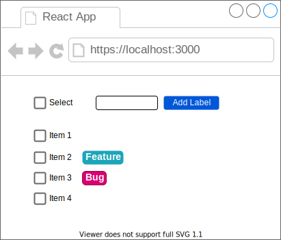

# React + TypeScript

## Wireframes



## Get Started

```
npx create-react-app react-bulk-edit --template typescript --use-npm
cd react-bulk-edit
```

## Steps

### Add Bootstrap

Add Bootstrap to `public/index.html`

```
<!-- CSS only -->
<link href="https://cdn.jsdelivr.net/npm/bootstrap@5.0.2/dist/css/bootstrap.min.css" rel="stylesheet" integrity="sha384-EVSTQN3/azprG1Anm3QDgpJLIm9Nao0Yz1ztcQTwFspd3yD65VohhpuuCOmLASjC" crossorigin="anonymous">
```

## References

https://create-react-app.dev/docs/adding-typescript/